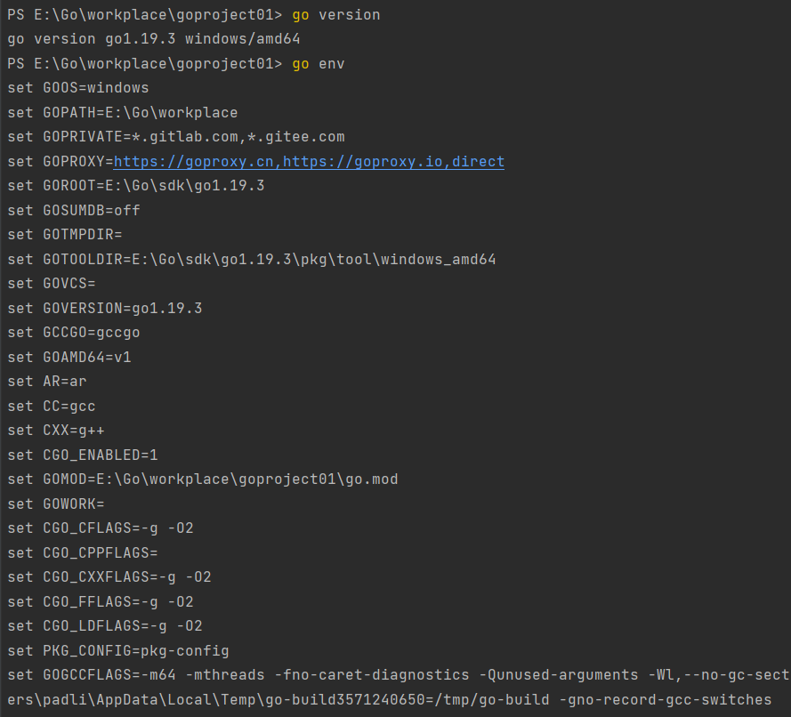
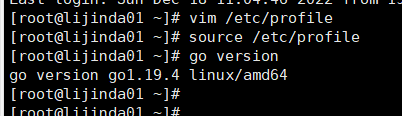

## Hello Golang

### golang 简介

​	Go 语言（又称Golang）是 Google 的 Robert Griesemer，Rob Pike 及 Ken Thompson  开发的一种**静态强类型**、编译型语言。功能上：内存安全，GC（垃圾回收），**结构形态**，**CSP-style 并发计算**。

### golang 特点

​	背靠大厂，可靠；**天然支持并发（最显著特点）**；语法简单易上手；**内置 runtime，支持垃圾回收**；可直接编译成机器码，不依赖其他库；标准库丰富；跨平台编译。

### go语言的应用领域

1. 服务器编程
2. 开发云平台
3. 区块链
4. 分布式系统
5. 网络编程

### 哪些公司在用go语言

* Google
  * k8s
* Facebook
* **腾讯**
  * 蓝鲸平台
  * 容器技术
* **字节跳动**
* **B站**
* 百度
* **京东**
  * 消息推送系统
  * 云存储
  * 京东商城
* 小米
  * 运维监控系统
  * 小米互娱
  * 小米商城
  * 小米视频
  * 小米生态链

## golang 语言开发环境的搭建

​	分别在 windows 和 linux 平台搭建go 1.19

## go 开发工具

​	当然 goland ！！！

## go 常用命令

* go help : 可显示所有的go 命令以及响应命令的功能简介
* build：编译包和依赖
* clean：移除对象文件
* doc：显示包或者符号的文档
* env：go环境信息
* bug：启动错误报告
* fix：运行go tool fix
* fmt：运行 gofmt 进行格式化
* generate：从processing source 生成go文件
* get：下载并安装包和依赖
* install：编译和安装包和依赖
* list：列出包
* run：编译并运行go程序
* test：运行测试
* tool：运行go提供的工具
* version：显示go的版本
* vet：运行 go tool vet

## 如何编写 go 代码

### 代码组织

go 应用使用**包和模块**来组织代码，包对应文件系统就是文件夹，模块就是**xxx.go**的go源文件。一个包中可以有多个模块，或者多个子包。

### go项目管理工具

> 早期的go项目使用gopath来管理项目，不方便而且容易出错。

从 golang 1.11开始使用gomod管理项目。当然还有第三方模块 如：govendor

### 实现步骤

1. 创建项目
2. 初始化项目 go mod init xxx
3. 创建包
4. 创建模块
5. 相互调用